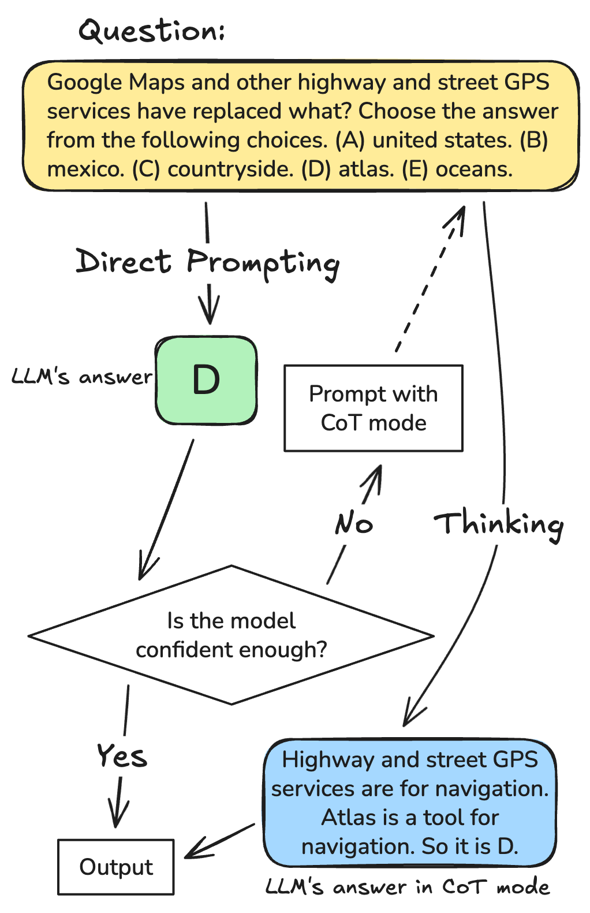

# Can Confidence Estimates Decide When Chain-of-Thought Is Necessary for LLMs?

This is the anonymous official repository for the paper "Can Confidence Estimates Decide When Chain-of-Thought Is Necessary for LLMs?".




# Data Collection

Quick command used in the scripts:

    python ~/confidence-gated-cot/data_collection/collect_confidence_and_cot.py --config ~/confidence-gated-cot/config_files/qwen3-8B/csqa_qwen8b.yaml

This runs the collector with the YAML config specified.

## What the YAML config contains
The config must match the ExperimentalConfig dataclass. Minimal example:

```yaml
dataset_path: "/absolute/path/to/dataset.parquet"   # file accepted by datasets.load_dataset("parquet")
model_name: "your/model-name"                      # Hugging Face model name
dataset_prefix: ""                                 # optional text prefixed to every question
batch_size: 2
resume: false                                      # true to resume from existing results
save_every: 200                                    # flush to disk after this many new rows
```

Notes:
- Use absolute paths in cluster job scripts for reproducibility.
- The script loads the parquet via datasets.load_dataset("parquet", data_files=config.dataset_path).

## Parquet dataset format 
The script expects a parquet file that, when loaded, provides a "train" split (datasets will create a single split named "train" for a single parquet file). Each row should be a record with at least:

- question (string) — the prompt/question text the model should answer
- answer (string, optional) — ground-truth answer used to compute correctness (if present)
- id (optional) — unique identifier for the question; if absent the row index is used

Examples of valid rows (columns):
- question: "What is 2+2?"
- answer: "4"
- id: "c281b7e3-49c2-4cd3-964d-4366f598d53a"


## Output
- Results are written to confidence_and_cot_results/<model_name>/<model_name>_<dataset_basename>_results.parquet
- Each row includes: question_id, question, ground_truth (if present), p_true_confidence, verbalised_confidence, margin_confidence, predictive_entropy_confidence, perplexity_confidence, generated responses, timings, and CoT outputs (when produced).
- Set `resume: true` to skip already-processed question IDs (the script detects existing question_id values in the output parquet).


# Generating budget / routing plots

Run the plotting script to reproduce the figures used in the paper. Example (one-line):

```bash
python analysis/routing_tradeoffs.py \
  --inputs confidence_and_cot_results/qwen3-8b/*_results.parquet \
  --model-name qwen3-8b \
  --outdir budget_results/qwen3-8b/all_datasets \
  --title "All Datasets" \
  --threshold-type percentile
```

Notes:
- The script writes two PDFs into the given --outdir:
  - *_routing_ratio_vs_accuracy*.pdf (CoT usage vs accuracy)
  - *_tokens_vs_accuracy*.pdf (tokens vs accuracy)
- Use `--online` to run online percentile routing (add `--num-runs N` for multiple randomized runs).
- Adjust `--threshold-type` (`percentile` or `absolute`) and `--gpt-effort` (`low|medium|high`) as needed.


# Running pareto-optimal analysis


Run a single-model analysis with the same settings used for the paper:

```bash
python analysis/pareto_calibration.py \
  --inputs confidence_and_cot_results/qwen3-8b/*_results.parquet \
  --model-name qwen3-8b \
  --confidence-types p_true verbalised margin perplexity \
  --percentile-step 5 \
  --epsilon 0.01 \
  --mc-repeats 100 \
  --calibration-frac 0.10 \
  --out pareto_results/qwen3-8b_pareto.csv
```

Repeat the command above with the appropriate `--inputs`, `--model-name` and `--out` for which ever model you want (gpt-oss-20b, qwen3-8b, qwen3-32b).


Notes:
- Ensure the input parquet files exist under confidence_and_cot_results/...
- Output CSVs are written to pareto_results/ by default.

## Supported models

This codebase currently supports the gpt-oss family and the qwen3 family of models only. Other model families are not supported at this time.